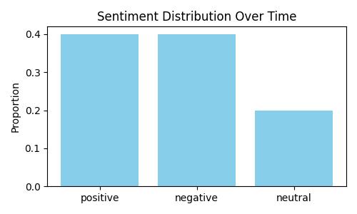

## Phase 1 – Sentiment Model
Implemented with Hugging Face model `cardiffnlp/twitter-roberta-base-sentiment-latest`.

## Phase 2 – CI/CD Pipeline
Automated training and deployment via GitHub Actions.

## Phase 3 – Deployment on Hugging Face
Model: [CapDimble/sentiment-monitoring-model](https://huggingface.co/CapDimble/sentiment-monitoring-model)

## Phase 4 – Continuous Monitoring
Simulates new data, logs predictions to `data/monitoring/sentiment_log.csv`,
and generates sentiment trends.

